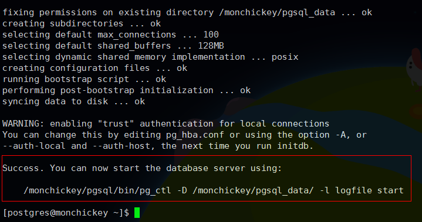

## 前言
- Linux版本：CentOS
- PostgresSQL版本：9.5.6

<!--more-->

## 安装

### 下载安装软件包
可直接去官网下载，下载后直接找个目录放进去就行，我这边的目录为'/usr/lib/pg/' **注意：该目录不是安装目录，所以安装完成后即可删除**

### 解压
```console
tar -zxvf postgresql-9.5.6.tar.gz
```

### 编译安装
```console
./configure

make

make install
```
- ./configure是检查当前环境能否安装PG，同时也可以使用 `./configure --help`查看参数命令
> 这里注意下`--prefix=PREFIX`该参数用于指定pg的安装目录，默认是`/usr/local/pgsql`这里我直接使用默认值。

> ./configure检测可能会提示系统未安装gcc等lib库，根据提示安装即可

### 创建postgres用户
posgresql默认使用postgres用户
```console
adduser postgres

mkdir /usr/local/pgsql/data

chown postgres /usr/local/pgsql/data
```

### 创建数据库
- 创建pgsql数据目录：`mkdir /mydir/pgsql_data`
- 给postgres用户添加访问权限：`chown postgres /mydir/pgsql_data/`
- 切换到postgres用户来操作数据库，pgsql数据库就以postgres为默认用户，执行： `su - postgres` 切换。切换之后建议修改~/.bash_profile将pgsql的bin目录加至环境变量中，方便直接使用pgsql相关命令
- 初始化数据库：`/usr/lib/pg/bin/initdb -D /mydir/pgsql_data/`,执行结果如下说明成功


### 配置数据库
配置远程访问需要修改两个配置文件`postgresql.conf`和`pg_hba.conf`
#### 修改监听地址
```conf
#listen_addresses=’localhost’
#将上面这行改成如下
listen_addresses=’*’
```

#### 添加IP授权
```conf
# 这是在/pgsql/data/pg_hba.conf文件里加
# IPv4 myhost connections:
host    all         all         0.0.0.0/0          trust
```
这里设置了对所有IP开发，可修改`trust`为`password`为远程登录设置密码，重启后生效

#### 启动/重启
```console
bin/pg_ctl start -D /mount/pgsql_data/ -l /mount/pgsql_log  //重启restart
```

### 设置远程登陆账户和密码
服务器本地登陆postgresql数据库（默认是不需要密码的）
```console
[postgres@localhost pgsql]$ pwd
/usr/local/pgsql
[postgres@localhost pgsql]$ bin/psql

psql.bin (9.5.9)

Type "help" for help.
```

- 创建角色，并且给角色设置密码:
```console
postgres=# create user testwjw with password 'Zykj@5&^%996';

CREATE ROLE
```
- 修改数据库用户和密码：
```console
postgres=# alter user testwjw with password '558996';

ALTER ROLE
```

- 指定字符集创建数据库testdb1，并且授权给testwjw
```console
postgres=# create database testdb1 with encoding='utf8' owner=testwjw;

CREATE DATABASE
```
- 授权：
```console
postgres=# grant all privileges on database testdb1 to testwjw; 

GRANT
```

#### 修改postgresql.conf文件中的端口和监听主机:

postsql默认安装后是监听本机127.0.0.1 默认端口是5432,是不能够远程登陆的，所以要修改监听主机地址postgresql数据库的配置文件是:postgresql.conf,所在位置是：postgresql初始化时所指定的data数据目录下：具体可参照上文的配置

#### 重启postgresql服务生效：

## 命令行下基础命令
### 基础查看指令
- 连接数据库，默认的用户和数据库postgres: `psql -U user -d dbname`
- 切换数据库，相当于mysql的use dbname : `\c dbname`
- 列举数据库，相当于mysql的show databases： `\l`
- 列举表，相当于mysql的show tables ： `\dt`
- 查看表结构，相当于desc tblname,show columns from tbname ：`\d tblname`
- 查看索引 : `\di`
- 退出 psql: `\q`

### 数据库操作相关指令
- 创建数据库： `create database [数据库名]`; 
- 删除数据库： `drop database [数据库名]`;  
- *重命名一个表： `alter table [表名A] rename to [表名B]`; 
- *删除一个表： `drop table [表名]`;
- *在已有的表里添加字段： `alter table [表名] add column [字段名] [类型]`; 
- *删除表中的字段： `alter table [表名] drop column [字段名]`; 
- *重命名一个字段：`alter table [表名] rename column [字段名A] to [字段名B]`; 
- *给一个字段设置缺省值： `alter table [表名] alter column [字段名] set default [新的默认值]`;
- *去除缺省值：`alter table [表名] alter column [字段名] drop default`; 
- 在表中插入数据： `insert into 表名 ([字段名m],[字段名n],......) values ([列m的值],[列n的值],......)`; 
- 修改表中的某行某列的数据： `update [表名] set [目标字段名]=[目标值] where [该行特征]`; 
- 删除表中某行数据： `delete from [表名] where [该行特征]`; 
- 删空整个表 : `delete from [表名]`;
- 创建表： `create table ([字段名1] [类型1] ;,[字段名2] [类型2],......<,primary key (字段名m,字段名n,...)>;); `
- 显示 PostgreSQL 的使用和发行条款 `\copyright`
- 显示或设定用户端字元编码: `\encoding [字元编码名称]`
- SQL 命令语法上的说明，用 * 显示全部命令 : `\h [名称]`


### 备份还原相关指令
可以使用pg_dump和pg_dumpall来完成。比如备份sales数据库： 
pg_dump drupal>/opt/Postgresql/backup/1.bak 

### 删除库的时候报错
```console
ERROR: database "temp_test_yang" is being accessed by other users
DETAIL: There are 4 other sessions using the database.
```
说明该temp_test_yang库正在被人连接。解决方法是：查询出连接该数据库的进程，并将其杀死(比较暴力)
select pg_terminate_backend(pid) from pg_stat_activity where DATNAME = 'temp_test_yang';
