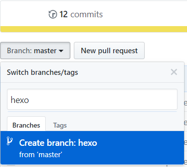

## 前言

> 喜欢写Blog的人，会经历三个阶段。————阮一峰

```
- 第一阶段，刚接触Blog，觉得很新鲜，试着选择一个免费空间来写。
- 第二阶段，发现免费空间限制太多，就自己购买域名和空间，搭建独立博客。
- 第三阶段，觉得独立博客的管理太麻烦，最好在保留控制权的前提下，让别人来管，自己只负责写文章。
```
由于平时比较懒所以第一、第二阶段虽然都经历过但都没坚持下来（理由吗、、、有很多），平时更多的是通过印象笔记之类的进行知识梳理及记录，但这种三方记录软件存在太多的限制，机缘巧合下遇上了hexo，擦！这不是就是我要找的吗，赶紧拿来学习！说来也惭愧用了这么多年的github直到今天才知道github pages的存在“众里寻他千百度，蓦然回首那人却在灯火阑珊处”说的就是我此时的心情吧。

网上对于如何使用hexo结合github pages搭建私有博客已经有很多教程，本文的目的只是做些简要的记录不做详细说明。**对于_config.yml的说明：hexo的位于根目录下`站点配置文件`，`主题配置文件`在对应的主题目录下**

## GitHub Pages
> Github Pages 是面向用户、组织和项目开放的公共静态页面搭建托管服务，站点可以被免费托管在 Github 上，你可以选择使用 Github Pages 默认提供的域名 github.io 或者自定义域名来发布站点。Github Pages 支持 自动利用 Jekyll 生成站点，也同样支持纯 HTML 文档，将你的 Jekyll 站 点托管在 Github Pages 上是一个不错的选择。

其实对于github pages的创建没什么可说的只需要创建一个“账号名+github.io”的仓库即可。创建完成后即可通过https://cjlovepp.github.io进行访问。

## hexo安装配置
要使用Hexo，需要在你的系统中支持Nodejs以及Git，如果还没有，ennnnn~~~装呗！

### 安装Node.js

### 安装Git

### 安装Hexo
关于Hexo的详细使用说明文档参考：https://hexo.io/zh-cn/docs/commands

- 创建一个空的文件夹（该文件夹用于站点的发布，所以最好不要随便放）
- Git Bash进入之前创建的目录

```console
npm install hexo-cli -g   
hexo init #初始化网站   
npm install   
hexo g #生成或 hexo generate   
hexo s #启动本地服务器 或者 hexo server,这一步之后就可以通过http://localhost:4000  查看了
```
## 部署到GitHub
通过设置"_config.yml"文件中的`deploy`来配置githup仓库地址，github提交时支持用户名密码和SSH Key两种方式,这里介绍SSH的配置方式

### 检查SSH keys设置

进入git bash
```console
    cd ~/.ssh
    ls
    #如果文件存在直接打开`*.pub`复制内容即可，如果没有则自己生成一个
    ssh-keygen -t rsa -C "邮件地址@youremail.com" #生成新的key文件,邮箱地址填你的Github地址
    #Enter file in which to save the key (/Users/your_user_directory/.ssh/id_rsa):<回车就好>
    #接下来会让你输入密码（直接回车也可以）
```

### 添加SSH Key到Github
进入github首页找到对应的repository，进入`setting`将key添加到`deploy keys`中。
```console
    #测试是否成功
    ssh -T git@github.com
    #之后会要你输入yes/no,输入yes就好了。
```

### 部署到github
```console
    hexo d
```
没错，就是这么简单。结束！

## 补充

### 图片存储解决
写技术类文章没有图片怎么行？一张到位的图片能省去大篇幅的文字说明（还不一定说的清），所以博客中插入图片便成了刚需，那么问题来了图片存哪合适呢？网上通用的解决方案 `七牛云` 我也曾用过一段时间，说实在的问题是解决了但体验并不是很好（每次要把图片先上传到七牛的服务器然后再使用），所以果断放弃！
在hexo发展至今都没有一个好的图片解决方案？开什么玩笑----`hexo-asset-image`，对喽就是这货，来看看具体怎么用吧。

- 首先确认`_config.yml` 中开启 `post_asset_folder:true`。
Hexo 提供了一种更方便管理 Asset 的设定：`post_asset_folder`当您设置post_asset_folder为true参数后，在建立文件时，Hexo会自动建立一个与文章同名的文件夹，您可以把与该文章相关的所有资源都放到那个文件夹，如此一来，您便可以更方便的使用资源。

- 安装 `hexo-asset-image`
```console
    npm install hexo-asset-image --save
```
- 完成安装后用hexo新建文章的时候会发现_posts目录下面会多出一个和文章名字一样的文件夹。图片就可以放在文件夹下面。结构如下：
```cmd
本地图片测试
├── apppicker.jpg
├── logo.jpg
└── rules.jpg
本地图片测试.md
```
这样的目录结构（目录名和文章名一致），只要使用 `` 就可以插入图片。
生成的结构为
```cmd
public/2016/3/9/本地图片测试
├── apppicker.jpg
├── index.html
├── logo.jpg
└── rules.jpg
```
同时，生成的 html 是

```html
    
```
而不是
```html
    
```
> 这种方式存在一个明显的弊端就是随着使用git会越来越大，但就目前我的需求来讲暂时不用考虑这些问题

### hexo主题配置
hexo只是很多主题获取主题的方式当然是通过官网 [主题](https://hexo.io/themes/)，如何启用主题都有对应的说明此处不多废话，进过精挑细后还是觉定采用社区比较认可的`NexT`,详细的使用说明可以参考 [中文文档](http://theme-next.iissnan.com/)

### hexo插件
可以去 [插件](https://hexo.io/plugins/) 找到很多有用的插件

### 添加【分类，标签】等功能
hexo可以对博客进行标签分类，侧边栏添加并实现分类和标签功能的做法类似，这里以`分类`为例
- 创建分类显示页面
```console
    hexo new page categories
```
你会发现你的source文件夹下有了categorcies/index.md，之所以命名为categories的原因是在next主题的配置文件中，categories是关键词。

- 编辑新建界面，将页面类型设置为categories，主题将会在这个页面上显示所有的分类：
```md
---
title: categories
date: 2018-03-02 12:33:16
type: "categories" //这点尤为重要否则分类页是空的
---
```
另外就是，需要注意一点：如果有启用多说 或者 Disqus 评论，默认页面也会带有评论。需要关闭的话，请添加字段 comments 并将值设置为 false，如：
```md
---
title: categories
date: 2018-03-02 12:33:16
type: "categories"
comments: false
---
```

- 在菜单中添加链接，此时需要编辑主题的_config.yml，hexo的配置文件事先写好了，但是处于注释状态，需要去除注释即可：
```yml
    menu:
      home: / || home
      about: /about/ || user
      tags: /tags/ || tags
      categories: /categories/ || th
      archives: /archives/ || archive
```

- 添加文章分类关联
把文章归入分类只需在文章的顶部标题下方添加categories字段，即可自动创建分类名并加入对应的分类中：
```md
    ---
    title: hexo+github pages博客之路起航
    date: 2018-07-31 17:08:10
    tags:
        - hexo
        - github pages
    categories: hexo
    ---
```

### 添加搜索
- 1、安装 hexo-generator-searchdb 插件
```console
    $ npm install hexo-generator-searchdb --save
```
- 2、打开 `站点配置文件`` 找到Extensions在下面添加
```cosole
    # 搜索
    search:
      path: search.xml
      field: post
      format: html
      limit: 10000
```
- 3、打开 `主题配置文件`` 找到Local search，将enable设置为true

### 添加阅读全文按钮
因为在你的博客主页会有多篇文章，如果你想让你的文章只显示一部分，多余的可以点击阅读全文来查看，那么你需要在你的文章中添加
```md
<!--more-->
```
其后面的部分就不会显示了，只能点击阅读全文才能看

### 提交hexo源码到github
hexo在将网站发布到github时只是将生成的静态页同步到github中，而编写的文件源码（xxx.md）并不会上传到git。这样的话当我们数据损坏或者需要在别的地方编写时就会很尴尬。所以最好的方式是我们把hexo源代码也上传到github中。

- 建立分支：因为 master 分支是存放 Hexo 博客生成的页面，所以只能创建一个分支来保存博客的源代码在你的 GitHub


- 设置默认分支为 `hexo`
**这里需要有注意站点配置文件 `_config.yml` 的 `deploy` 需要设置成 `master`**

- OK，提交到代码到 `hexo` 分支即可

### 自动部署到github pages

<!--more-->