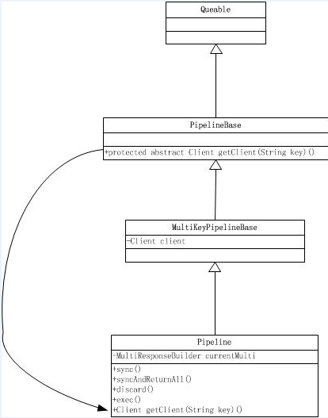

## 前言
Redis的pipeline(管道)功能在命令行中没有，但redis是支持pipeline的，而且在各个语言版的client中都有相应的实现。 由于**网络开销延迟**，就算redis server端有很强的处理能力，也会由于收到的client消息少，而造成吞吐量小。当client 使用pipelining 发送命令时，redis server必须将部分请求放到队列中（使用内存），执行完毕后一次性发送结果；如果发送的命令很多的话，建议对返回的结果加标签，当然这也会增加使用的内存；

  Pipeline在某些场景下非常有用，比如有多个command需要被“及时的”提交，而且他们对相应结果没有互相依赖，对结果响应也无需立即获得，那么pipeline就可以充当这种“批处理”的工具；而且在一定程度上，可以较大的提升性能，性能提升的原因主要是TCP连接中减少了“交互往返”的时间。

  不过在编码时请注意，pipeline期间将“独占”链接，此期间将不能进行非“管道”类型的其他操作，直到pipeline关闭；如果你的pipeline的指令集很庞大，**为了不干扰链接中的其他操作，你可以为pipeline操作新建Client链接，让pipeline和其他正常操作分离在2个client中**。不过pipeline事实上所能容忍的操作个数，和socket-output缓冲区大小/返回结果的数据尺寸都有很大的关系；同时也意味着每个redis-server同时所能支撑的pipeline链接的个数，也是有限的，这将受限于server的物理内存或网络接口的缓冲能力。

<!-- more-->

## 原理说明
Redis使用的是客户端-服务器（CS）模型和请求/响应协议的TCP服务器。这意味着通常情况下一个请求会遵循以下步骤：

- 客户端向服务端发送一个查询请求，并监听Socket返回，通常是以阻塞模式，等待服务端响应。
- 服务端处理命令，并将结果返回给客户端。
  Redis客户端与Redis服务器之间使用TCP协议进行连接，一个客户端可以通过一个socket连接发起多个请求命令。每个请求命令发出后client通常会阻塞并等待redis服务器处理，redis处理完请求命令后会将结果通过响应报文返回给client，因此当执行多条命令的时候都需要等待上一条命令执行完毕才能执行。
其执行过程如下图：


由于通信会有网络延迟，假如client和server之间的包传输时间需要0.125秒。那么上面的三个命令6个报文至少需要0.75秒才能完成。这样即使redis每秒能处理100个命令，而我们的client也只能一秒钟发出四个命令。这显然没有充分利用 redis的处理能力。

  而管道（pipeline）可以一次性发送多条命令并在执行完后一次性将结果返回，**pipeline通过减少客户端与redis的通信次数来实现降低往返延时时间，而且Pipeline 实现的原理是队列，而队列的原理是时先进先出，这样就保证数据的顺序性**。 Pipeline 的默认的同步的个数为53个，也就是说arges中累加到53条数据时会把数据提交。其过程如下图所示：client可以将三个命令放到一个tcp报文一起发送，server则可以将三条命令的处理结果放到一个tcp报文返回。

需要注意到是用 pipeline方式打包命令发送，redis必须在处理完所有命令前先缓存起所有命令的处理结果。**打包的命令越多，缓存消耗内存也越多。所以并不是打包的命令越多越好**。具体多少合适需要根据具体情况测试。

## Jedis演示
使用Pipeline在对Redis批量读写的时候，性能上有非常大的提升。使用Java测试了一下：
```java
import java.util.HashMap;
import java.util.Map;
import java.util.Set;
import redis.clients.jedis.Jedis;
import redis.clients.jedis.Pipeline;
import redis.clients.jedis.Response;

public class Test {
    public static void main(String[] args) throws Exception {
        Jedis redis = new Jedis("127.0.0.1", 6379, 400000);
        Map<String, String> data = new HashMap<String, String>();
        redis.select(8);
        redis.flushDB();
        // hmset
        long start = System.currentTimeMillis();
        // 直接hmset
        for (int i = 0; i < 10000; i++) {
            data.clear();
            data.put("k_" + i, "v_" + i);
            redis.hmset("key_" + i, data);
        }
        long end = System.currentTimeMillis();
        System.out.println("dbsize:[" + redis.dbSize() + "] .. ");
        System.out.println("hmset without pipeline used [" + (end-start)/1000 + "] seconds ..");
        redis.select(8);
        redis.flushDB();
        // 使用pipeline hmset
        Pipeline p = redis.pipelined();
        start = System.currentTimeMillis();
        for (int i = 0; i < 10000; i++) {
            data.clear();
            data.put("k_" + i, "v_" + i);
            p.hmset("key_" + i, data);//将命令缓存起来
        }
        p.sync();//一次性提交所有命令
        end = System.currentTimeMillis();
        System.out.println("dbsize:[" + redis.dbSize() + "] .. ");
        System.out.println("hmset with pipeline used [" + (end-start)/1000 + "] seconds ..");
        // hmget
        Set keys = redis.keys("*");
        // 直接使用Jedis hgetall
        start = System.currentTimeMillis();
        Map<String, Map<String, String>> result = new HashMap<String, Map<String, String>>();
        for (String key : keys) {
            result.put(key, redis.hgetAll(key));
        }
        end = System.currentTimeMillis();
        System.out.println("result size:[" + result.size() + "] ..");
        System.out.println("hgetAll without pipeline used [" + (end-start)/1000 + "] seconds ..");
        // 使用pipeline hgetall
        Map<String, Response<Map<String, String>>> responses = new HashMap<String, Response<Map<String, String>>>(keys.size());
        result.clear();
        start = System.currentTimeMillis();
        for (String key : keys) {
            responses.put(key, p.hgetAll(key));//缓存命令，并将结果集放入到responses中，注意，这里并没有正在返回结果
        }
        p.sync();//提交所有指令
        for (String k : responses.keySet()) {//一次性获取结果，因为pipeline是基于队列的所以顺序也能得到保障
            result.put(k, responses.get(k).get());
        }
        end = System.currentTimeMillis();
        System.out.println("result size:[" + result.size() + "] ..");
        System.out.println("hgetAll with pipeline used [" + (end-start)/1000 + "] seconds ..");
        redis.disconnect();
    }
}
```
测试结果：
```console
    //使用pipeline来批量读写10000条记录，就是小菜一碟，秒完。
    dbsize:[10000] ..
    hmset without pipeline used [243] seconds ..
    dbsize:[10000] ..
    hmset with pipeline used [0] seconds ..
    result size:[10000] ..
    hgetAll without pipeline used [243] seconds ..
    result size:[10000] ..
    hgetAll with pipeline used [0] seconds ..
```

## pipeline源码解读
### Pipeline类的结构


### Jedis的Pipeline的实现
看下上面的使用例子
```java
    Pipeline p = redis.pipelined();
    ....
    for(){
        p.hmset("key_" + i, data);//将命令缓存起来
    }
    p.sync();
```
#### 获取Pipeline对象
BinaryJedis有一个成员变量pipeline，通过其pipeline()方法可以获取Pipeline对象

 
 对的，就是它 
 
 pipeline()方法就干了一件事情，new了一个Pipeline对象，并设置了该对象的client属性！

#### Pipeline对象set方法干了啥
pipeline的set方法实际调用的是Pipelinebase类（Pipeline父类的父类）的set方法： 

而getClient调用子类的实现： 


#### 调用client的set操作
调用client的set操作跟踪源码发现实际是调用了`sendCommand(Command.SET,key,value)`方法。**注意了，所有的cmd与参数都写入了outputstream **

Jedis定义了自己的输入流与输出流，现在所有的commands都在outputstream里面了，但是还没有传到redis客户端 


#### Pipeline对象sync方法干了啥
在上面Pipelinebase的set方法的最后了，调了一个getResponse()方法。该方法相当于把每一次的请求操作加入到一个Queue里面，这个队列有啥用？先放在这里！
 
来看一下万恶的sync（）方法，注意红色的部分：
 
- 这个getPipelinedResponseLength()就是获取刚才的那个Queue的长度； 
- 看看getMany()方法，一上来就fush(),这下前面代码循环写入的那么多set命名全部传到redis server了！
> ps:flush刷新此输出流并强制写出所有缓冲的输出字节。flush 的常规协定是：如果此输出流的实现已经缓冲了以前写入的任何字节，则调用此方法指示应将这些字节立即写入它们预期的目标。

 

- generateResponse(o)就是拿到返回值了，sync是没有返回值的，syncAndReturnAll有返回值

## 适用场景
有些系统可能对可靠性要求很高，每次操作都需要立马知道这次操作是否成功，是否数据已经写进redis了，那这种场景就不适合。

  还有的系统，可能是批量的将数据写入redis，允许一定比例的写入失败，那么这种场景就可以使用了，比如10000条一下进入redis，可能失败了2条无所谓，后期有补偿机制就行了，比如短信群发这种场景，如果一下群发10000条，按照第一种模式去实现，那这个请求过来，要很久才能给客户端响应，这个延迟就太长了，如果客户端请求设置了超时时间5秒，那肯定就抛出异常了，而且本身群发短信要求实时性也没那么高，这时候用pipeline最好了。